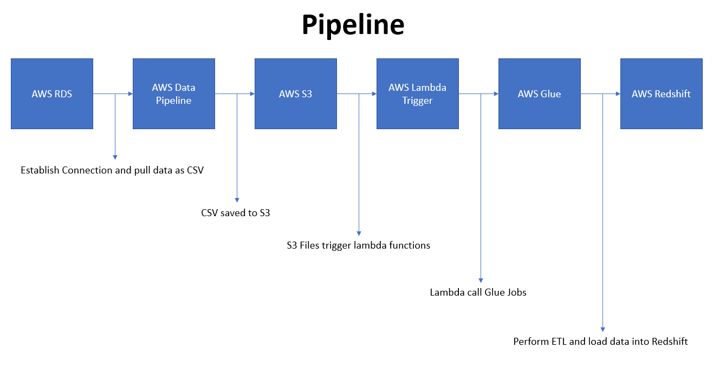

# E-Commerce Pipeline

### Problem Statement
- An E-Commerce company has a MySQL Database in AWS RDS.
- Sync the data from MySQL transactional system into AWS Redshift DWH.
- Capture the data from external sources(user behaviour data, click streams, etc) transform and centralize the data into a single infrastructure. 
- Generate report/KPI and metrics for decision making, machine learning and analysis.

---

### Dataset

[Brazilian E-Commerce Public Dataset by Olist](https://www.kaggle.com/olistbr/brazilian-ecommerce) on Kaggle

---

### Components

- AWS Reshift DWH
- AWS Glue
- AWS Athena
- AWS Data Pipeline
- Redshift Spectrum
- Quicksight for Reporting/BI

---

### Methodology

**Setup AWS RDS and Redshift**
- Create an AWS RDS instance(MySQL), *ecommerce-db*
- Edit inbound rules of the default security group under VPC to establish connection with RDS
- Connect to the RDS instance endpoint , create database, *ecommerce_db*, create tables and insert data into them using the dataset in Dataset/*
- 
- Create an IAM Role with a policy `AmazonRedshiftFullAccess`
- Create a Redshift cluster, *ecommerce-cluster*, and attach the IAM Role
- Edit inbound rules of the default security group under VPC to establish connection with Redshift cluster

**ETL and Syncing Transactional Data with Data Warehouse**


- Create a S3 bucket, *mysql-dwh*
- Create a Data Pipeline, *import_orders_historical*
  - Source > RDS Templates > Full copy of RDS MySQL table to S3
  - Output S3 folder > *s3://mysql-dwh/orders/historical*
  - Schedule > On pipeline activation
  - Edit in Architect:
    -  DataNodes > Table > Query in rds_to_s3/orders/import_orders_historical.sql 
    -  DataNodes > S3OutputLocation > Remove directory path & add file path > *#{myOutputS3Loc}/orders.csv*
    -  Others > rds_mysql > Add optional field > Database Name > *ecommerce_db*
  - Activate the job
- Create new schema in redshift, *mysql_dwh* and create tables inside this schema using query in redshift_sql/create_tables_redshift.sql
- Use the copy command in redshift_sql/copy_cmd.sql to copy csv in s3 into redshift data warehouse
- Create an AWS Glue connection, *redshift-connection* to connect to redshift cluster
- Create a new IAM Role with `AmazonRedshiftFullAccess`, `AWSGlueConsoleFullAccess`, and `AWSGlueServiceRole` policies attached for allowing glue to access redshift
- Attach the IAM Role to the Glue connection and test connection
- Create a new Data Pipeline, *import_orders_hourly*
  - Source > RDS Templates > Full copy of RDS MySQL table to S3
  - Output S3 foler > *s3://mysql-dwh/orders/current*
  - Schedule > on a schedule > 1 hour
  - Edit in Architect:
    - DataNodes > Table > Query in rds_to_s3/orders/import_orders_hourly.sql
    - DataNodes > S3OutputLocation > Remove directory path & add file path > *#{myOutputS3Loc}/orders.csv*
    - Others > rds_mysql > Add optional field > Database Name > *ecommerce_db*
  - Activate the job
- Open Secret Manager service and store credentials for redshift cluster
- Create staging table in redshift cluster, *mysql_dwh_staging* called orders to prevent direct copy of data into main table
- Attach `secretsManager` policy to the Glue IAM role
- Add job on AWS Glue, *glue_import_orders_hourly*, attach the IAM role and this job runs on a script authored by you
- Select the connection created earlier
- Create python shell job(Python/python-shell-jobs) *glue_import_orders.py* to update the main table with updated hourly values
- Run the Glue job
- Create a lambda function(Python/python-lambda-functions/trigger_orders_hourly_1.py), *lambda_handler* with an IAM for Glue full access to automate the process of triggering glue jobs everytime the hourly tables gets updated in the S3 bucket


- Perform the above steps for the other tables as summarized below:
  - Clone the created pipeline to create more data pipelines for other historical and hourly tables through which I import data from RDS to S3 using the SQL scripts in SQL/rds_to_s3/*
  - Create tables in redshift using the script in redhsift_sql/create_tables_redshift.sql and copy the csv in S3 into the data warehouse
  - Create a staging table in redshift and a glue connection. Setup glue jobs using the python shell scripts in Python/python-shell-jobs/* to update the hourly values into the historical main table
  - Setup Lambda functions using scripts in Python/python-lambda-functions/* to get triggered everytime the hourly jobs are updated

**Data Lakes & Handling External Data Sources**

- Create a new S3 bucket, *dwh-external-data* and create user_behaviour/2016_funnel.csv
- Create a Glue Crawler:
  - Name:  *user_behaviour_crawler*
  - Source: Data stores
  - Data source: *s3://dwh-external-data/user_behaviour/*
  - Choose existing IAM role that is connecting redshift, S3, glue and secrets manager
  - Frequency: Run on demand
  - Database:
    - Name: *ecommerce_external_data*
  - Grouping behaviour for S3 data: Create single schema for each S3 path
  - Configuration options:
    - Ignore change and don't update table in data catalog
    - Mark table as deprecated in the data catalog
  - Run the crawler
- Glue Console > Tables > *user_behaviour* > edit schema > Rename the column names
- Glue Console > Select *user_behaviour* > Action > Edit table details > Add *skip.header.line.count = 1* > Apply
- In AWS Athena, select the table, *ecommerce_external_data.user_behaviour* and preview table
- Reading of csv files reduces the compute time for any type of query, hence use pyspark script in Python/pyspark/pyspark-etl-local.py, locally to read the csv file and convert it into parquet format
- Create a Glue job, *funnel_data_etl_pyspark*, of type spark(v2.4)
- Make few changes to the above created script as in Python/pyspark/Ecom-funnel-data-ETL.py to operate of AWS Glue and paste in Glue
- Save and run job
- Edit the existing Glue Crawler:
  - Data Store: *s3://dwh-external-data/parquet_output/*
- Run crawler
- Glue Console > Tables > parquet_output > *compressionType = snappy* > Apply
- In AWS Athena, select table, *ecommerce_external_data.parquet_output* and preview table
- Notice the Data scanned size start varying with different types of queries efficiently
- Setup lambda function, *etl_pyspark_trigger* script as in Python/python-lambda-functions/pyspark-etl-job-trigger.py to automate the process of triggering the glue job every hour
- Add the other csv's to the S3 bucket and the glue job should autoatically trigger and create three partitions of parquet files
- In glue, run the crawler
- In athena, preview the table


**Redshift Spectrum**

- Create an external schema, *dwh_external_data_spectrum* in redshift spectrum using first command in script SQL/redshift_sql/create_external_schema.sql and attach it with the existing redshift IAM role with two more policies attached(S3, Glue)
- Create an external table, *user_data_file* in redshift spectrum using second command in SQL/redshift_sql/create_external_schema.sql
- Perform a join between redshift table and redshift spectrum table using the script in SQL/reshift_sql/join_schemas.sql


**Quicksight - BI  Reporting and Visualization**

- VPC > Create security group > *Quicksight-Redshift-Access* > select redshift VPC > Create > Edit Inbound rules > Add rule > TCP > Port: 5439 > Get the IP address range for the region > Save
- Redshift > Select cluster > Modify > VPC security groups > select above created VPC > Modify cluster
- Quicksight > Manage data > New dataset > redshift(auto discovered) > Source: *orders* > Create data source
- Schema: *mysql_dwh*, Table: *orders* > Edit/Preview data
- *orders_ds* > Save & visualize
- Play
- Publish dashboard
- Create customer query and save it as a view
- Create a new redhsift dataset and name it sales by category, and select the view created above > edit/preview data > Save
- Play


**Redshift - Optimization Techniques and Fine tuning**

- Sort keys:
  - determine the order in which the data is stored in redshift tables
  - allow skipping of large number of rows during the process of query execution thus improving the query performance
  - types:
    - Compound    : made of all columns listed in sort key definition in the order defined
    - Interleaved : gives equal weight to each column in redshift sort keys
- Vacuum Operations:
  - process of reclaiming any free space created after delete or update operations
  - improves performance because we end up with a compactly sorted table
  - should hapen during period of inactivity
  - types > full, delete only, sort only, reindex
- Distribution Keys:
  - determine where data is stored
  - determines how much data needs to be redistributed or shuffled aross the different nodes in your cluster
  - types: Even, key, all

- Redshift > config > workload management > parameters > Create > *new-param-group* > Edit parameters > search_path > *mysql_dwh* > save
- Cluster > Modify > Database configurations > parameter groups : *new-param-group* > Modify cluster
- Reboot cluster
- SQL Command to add keys
```sql
create table mysql_dwh.orders_test as select * from mysql_dwh.orders

alter table mysql_dwh.orders_test
alter compound sortkey(order_purchase_timestamp, order_id)

alter table mysql_dwh.orders_test
alter distkey order_id
```
