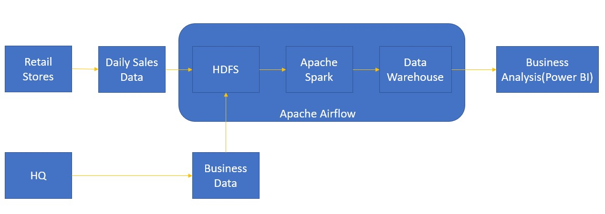
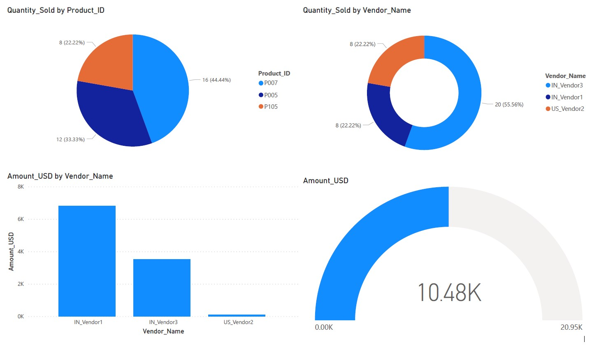

# E-Commerce

### Problem Statement

- An E-Commerce company has a chain of retail stores, serving the customers world-wise, with a wide range of products.
- This company has 4000+ retail stores, selling worldwide and generating sales data at their POS(Point Of Sale) Systems.
- This daily data from the POS systems worldwide, gets pushed into the Big Data Pipeline, for cleaning, processing and business analysis.

---

### Data Pipeline



---

### Software Requirements

- PyCharm IDE
- Locally installed [Spark-2.3.2](https://archive.apache.org/dist/spark/spark-2.3.2/spark-2.3.2-bin-hadoop2.7.tgz)
- HDP running on VirtualBox
- XAMPP Control Panel
- MySQL Workbench
- Configure Python 3.7 and Apache Airflow on HDP using the following commands:
```bash
su root
yum install gcc openssl-devel bzip2-devel libffi libffi-devel
mkdir /home/python3
cd /home/python3
wget https://www.python.org/ftp/python/3.7.0/Python-3.7.0.tgz
tar xzf Python-3.7.0.tgz
cd Python-3.7.0
./configure
make altinstall
python3.7 --version

# Installing Apache Airflow
export AIRFLOW_HOME=/home/airflow
pip3.7 install apache-airflow


# In case of any “__sqlite3” errors
yum install -y gcc openssl-devel bzip2-devel libffi-devel make sqlite-devel
cd /home/python3/Python-3.7.0
./configure --enable-optimizations && make -j4 altinstall
pip3.7 install apache-airflow

# Working with Apache Airflow
airflow db init
airflow webserver -p
airflow scheduler
```

---

### Business Requirements

**Columns in Daily Data**:
- `Sale_ID`
- `Product_ID`
- `Quantity_Sold`
- `Vendor_ID`
- `Sale_Date`
- `Sale_Amount`
- `Sale_Currency`

**Conditions**:
- If any missing columns due to network failure, `Quantity_Sold` and `Vendor_ID` holds the data till updates are received.
- Release Hold records in case the updates are received in consecutive day's data.
- `Sale_Amount` must derive from product price provided by HQ, considering `Sale_Currency` is USD.
- Get vendor details from Business data and bind the final extract, for reporting and analysis.
- Get complete sales data, per `Sale_ID` to be fetched for reporting.

---

### Project on HDP Cluster

- Copy the local project into the HDP cluster and configure the values accordingly.
  
    `scp -P 2222 -r RetailStoresPipeline root@127.0.0.1:/root`

---

### Pipeline Orchestration

- `cd /home/airflow/dags`
- `touch RetailStoresDAG.py`
```python
from datetime import timedelta, datetime
from airflow import DAG
from airflow.operators.bash import BashOperator
from airflow.utils.dates import days_ago

default_args = {
    'owner': 'hdfs',
    'depends_on_past': False,
    'start_date': datetime(2020, 1, 8),
    'email': ['x@y.com'],
    'email_on_failure': False,
    'email_on_retry': False,
    'retries': 1,
    'retry_delay': timedelta(minutes=5),
   }

dag = DAG(
    'RetailStoresPipeline',
    default_args=default_args,
    description='Retail Stores DAG'
)

t1 = BashOperator(
    task_id='DailyDataIngestAndRefine',
    bash_command='spark-submit --master yarn --deploy-mode cluster --py-files /home/RetailStoresPipeline/src/main/python/functions.py /home/RetailStoresPipeline/src/main/python/DailyDataIngestAndRefine.py',
    dag=dag,
)

t2 = BashOperator(
    task_id='EnrichProductReference',
    depends_on_past=False,
    bash_command='spark-submit --master yarn --deploy-mode cluster --py-files /home/RetailStoresPipeline/src/main/python/functions.py /home/RetailStoresPipeline/src/main/python/EnrichProductReference.py',
    retries=3,
    dag=dag,
)

t3 = BashOperator(
    task_id='VendorEnrichment',
    depends_on_past=False,
    bash_command='spark-submit --master yarn --deploy-mode cluster --py-files /home/RetailStoresPipeline/src/main/python/functions.py /home/RetailStoresPipeline/src/main/python/VendorEnrichment.py',
    dag=dag,
)

t1 >> t2 >> t3
```
- `export AIRFLOW_HOME=/home/airflow`
- `airflow initdb`
- `airflow webserver -p 8081`
- `airflow scheduler`

---

### Report

