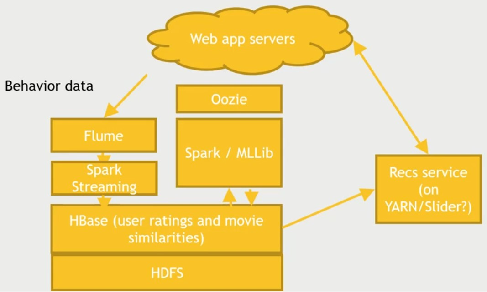
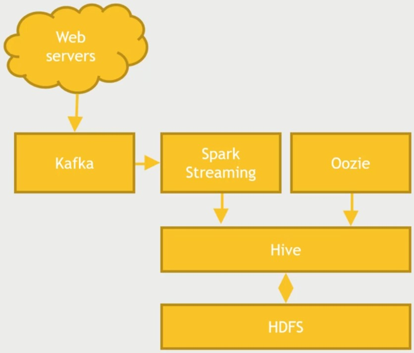

# Top Sellers

### What to build?

A system to track and display the top 10 selling items on an e-commerce website.

---

### Functional Requirements

- Must be fast
- NoSQL Solution
- Access pattern: "Top N Sellers"
- Hourly updated
- Highly available
- Partiton Tolerance and Availability over Consistency

---

### Decisions

- Partition Tolerance + Availability = Cassandra
- Setup Spark Streaming to get data into Cassandra
- Kafka/Flume to get data into Spark Streaming
- Security = Personally Identifiable Information (PII)

---

### System Design

---

### Other Alternatives

- Sqoop -> Spark -> Cassandra
- Cassandra -> Hbase/Mongo/Redis
- Flume -> Kafka
- For analytics -> Store in HDFS

---

# Movie Recommendations

### What to build?

- Users should be able to discover movies they haven't seen yet
- Their behavior are the best predictors
- Availability and partition tolerance are important

---

### Requirements

- Cassandra
- Spark MLLib / Flink

---

### Decisions

- Pre-computing recommendations
  - Isn't timely
  - Wastes resources
- Item-based collaborative filtering
- Quick look up of similar movies
- Also quickly get part ratings as well

---

### System Design

---

# Design Web Analytics

### What to build?

Track number of sessions per day on a website.

---

### Requirements

- Run daily based on previous day's activity
- Sessions = traffic from same IP address within a sliding hour window
- Data is only used for analytic purposes

---

### System Design

---